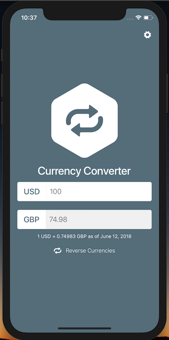

# React Native to Production Course App

This is the repo for the course [React Native to Production](https://learn.handlebarlabs.com/p/learn-to-send-react-native-apps-to-production).

Feel free to use this app as an example to structure your own app off of! It's a fully featured currency converter with multiple themes.

## Prerequisites

To run this application you'll need to be able to run a "pure" React Native application. If you haven't already please visit the [Getting Started guide](https://facebook.github.io/react-native/docs/getting-started.html) for React Native, click "Building Projects with Native Code", and configure your development environment. Once you've done that you're set!

## Installation

Run the following commands from your terminal:

* `git clone https://github.com/HandlebarLabs/production-ready-react-native.git`
* `cd production-ready-react-native`
* `yarn install`

## Running

* iOS: `yarn run ios`
* Android: `yarn run android`
